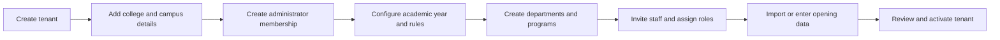
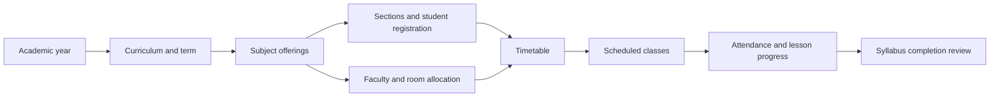
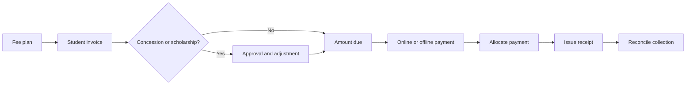

# Business Workflows

These workflows show how records should move through the system. Exact names and approval levels may be configured by each college, but important steps must not be skipped silently.

## 1. College Onboarding

Activation should require minimum configuration checks. A tenant without an academic year, administrator, or program structure is not ready for normal operation.

## 2. Admission to Student Enrollment

```mermaid
flowchart LR
    A[Enquiry] --> B[Applicant account]
    B --> C[Application submitted]
    C --> D[Documents verified]
    D --> E[Merit and quota processing]
    E --> F[Selection or waiting list]
    F --> G[Admission offer]
    G --> H[Applicant accepts]
    H --> I[Initial invoice and payment]
    I --> J[Admission approved]
    J --> K[Student and enrollment created]
    K --> L[Program, batch and section assigned]
```

Important rules:

- An enquiry is not automatically an application.
- An application is not automatically a student.
- Document verification records who checked each document.
- Seat availability must be checked before a final offer.
- Applicant-to-student conversion must be transactional and must preserve the application history.
- Cancellation should release the seat and trigger the configured refund workflow.

## 3. Academic Setup and Delivery

The timetable should detect faculty, room, and student-group conflicts. Attendance must originate from scheduled classes so that the system knows which students, faculty, subject, and period were involved.

## 4. Attendance and Correction

1. The timetable creates a class session.
2. The assigned faculty records attendance using permitted statuses.
3. The faculty submits and locks the register.
4. The system updates student and subject summaries.
5. Shortage rules produce alerts and notifications.
6. A later correction requires a reason and, when configured, approval.
7. The original value and corrected value remain in the audit history.

Percentages are calculated results, not manually entered facts.

## 5. Fee Billing and Payment

Important rules:

- A fee structure defines charges; an invoice records what a student owes.
- A payment records money received; a receipt confirms that transaction.
- A failed online payment must not create a successful receipt.
- Gateway callbacks must be idempotent so the same callback cannot collect twice.
- Refunds and mistakes use reversals or credit notes rather than deleting history.
- Pending fees are calculated from invoices, adjustments, allocations, and reversals.

## 6. Examination and Result Publication

```mermaid
flowchart LR
    A[Assessment scheme] --> B[Exam session and schedule]
    B --> C[Eligibility and registration]
    C --> D[Exam conducted]
    D --> E[Marks entered]
    E --> F[Marks verified and locked]
    F --> G[Grades and results calculated]
    G --> H[Controller approval]
    H --> I[Results published]
    I --> J[Revaluation or supplementary process]
```

Students see only published results. Any reopening after publication requires authorization, a reason, recalculation, and a retained audit trail.

## 7. Student Progression

At the end of a term or academic year:

1. Confirm attendance and examination outcomes.
2. Apply the curriculum's progression rules.
3. Record pass, promotion, detention, arrears, or discontinuation.
4. Create the next enrollment where eligible.
5. Carry permitted arrears without rewriting old results.
6. At program completion, verify credits and requirements.
7. Mark the student graduated and retain access according to policy.
8. Create or update the alumni profile.

## 8. Supporting Service Allocation

Library membership, hostel beds, transport routes, event participation, and placement applications must reference the existing student enrollment. These modules should not create separate copies of the student profile.

Allocations require effective start and end dates. This preserves history when a student changes a room, route, section, or service.

## 9. Communication Flow

1. An authorized user creates a message from a template or as a new notice.
2. The sender chooses an audience by role or academic group.
3. The system previews the number of recipients.
4. An approval step is applied where required.
5. The message is sent through enabled channels.
6. Delivery, failure, retry, and acknowledgement are recorded.

Sensitive student information must not be included in broad notices or exposed to unrelated recipients.

## 10. Graduation and Alumni

Graduation is a controlled status change, not deletion:

- Confirm credits, results, dues, and required clearances.
- Generate approved transcripts and completion documents.
- Close active academic and service allocations.
- Retain immutable academic and financial history.
- Move the person into alumni services while preserving the same identity.
