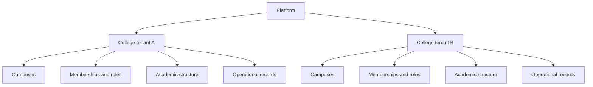

# Multi-Tenant Architecture

## Architecture Goal

The CMS will be one web product used by multiple colleges. The architecture must provide strong tenant isolation, configurable college rules, reliable transaction history, and room for modules to grow without duplicating core records.

## Recommended Technology Direction

The final stack should follow the implementation team's strengths. A practical starting point is:

- **Frontend:** React with TypeScript
- **Backend:** FastAPI with Python, or another established typed web framework
- **Database:** PostgreSQL
- **Documents:** S3-compatible object storage
- **Background jobs:** A durable queue for email, SMS, imports, exports, and reports
- **Cache:** Redis only when justified by measured needs or queue selection
- **Deployment:** Containerized application with separate development, test, staging, and production environments

The database and business rules are more important than choosing a particular visual framework.

## Tenant Model



Use a shared PostgreSQL database and shared schema initially. Every tenant-owned record carries `tenant_id`, and PostgreSQL Row-Level Security provides a database-level barrier between colleges.

## Mandatory Isolation Rules

1. Derive the active tenant from the authenticated membership, not from an untrusted request field.
2. Add `tenant_id` to every tenant-owned table.
3. Include tenant scope in unique constraints, such as `(tenant_id, registration_number)`.
4. Prevent cross-tenant foreign-key relationships using tenant-safe constraints.
5. Set the tenant context transaction-locally before accessing tenant-owned data.
6. Force Row-Level Security for application database roles.
7. Store files under tenant-specific paths and authorize every download.
8. Scope cache keys, jobs, exports, logs, and analytics by tenant.
9. Test tenant isolation by deliberately attempting cross-tenant access.
10. Never bypass isolation merely to simplify reports or support tools.

## Identity and Membership

A person may use one login with access to more than one college. Access is represented by a membership rather than storing one `tenant_id` directly on the user.

```text
users
tenants
tenant_memberships
roles
permissions
role_permissions
membership_roles
membership_scopes
```

This allows one user to be a faculty member in one college and an administrator in another without mixing permissions.

## Core Data Boundaries

Do not store the entire system in one student or employee table. Separate records by lifecycle and responsibility.

### Institution and academics

```text
tenants
campuses
academic_years
terms
departments
programs
curricula
curriculum_subjects
batches
sections
subjects
subject_offerings
rooms
```

### People, admissions, and students

```text
people
contact_methods
applications
application_documents
admission_reviews
admission_offers
students
student_guardians
student_enrollments
student_subject_registrations
student_status_history
student_documents
```

The same person's information should not be copied into independent admissions, student, library, hostel, and placement profiles.

### Academic delivery

```text
faculty_assignments
timetable_entries
class_sessions
attendance_records
lesson_plans
syllabus_progress
assessments
exam_sessions
mark_entries
published_results
```

### Finance

```text
fee_heads
fee_plans
student_invoices
invoice_lines
concessions
payments
payment_allocations
receipts
refunds
financial_adjustments
```

Use decimal database types for money. Do not use floating-point values.

## Record History and Effective Dates

Academic structures and rules change over time. Records must keep their historical meaning.

- Curriculum changes create a new version rather than altering old student results.
- Fee plan changes do not rewrite issued invoices.
- Room, route, section, and staff assignments have start and end dates.
- Published results are immutable unless reopened through a controlled process.
- Financial corrections use linked reversal records.
- Status changes are recorded in history tables.

## Backend Structure

Organize the backend by business domain rather than one large routes file:

```text
platform
identity
institutions
academics
admissions
students
attendance
finance
examinations
communications
library
hostel
transport
placements
activities
hr
reporting
```

Each domain should contain its API routes, request/response schemas, service rules, and persistence models while sharing authentication, tenant context, audit, files, and notifications through well-defined platform services.

## API Design

- Use versioned APIs, for example `/api/v1/...`.
- Validate all inputs with explicit schemas.
- Use stable public identifiers where exposing sequential database IDs is undesirable.
- Apply pagination, filtering, and sorting to list endpoints.
- Make payment callbacks, imports, and retryable commands idempotent.
- Return structured validation errors understandable by the web interface.
- Check permissions in backend services, never only by hiding buttons.
- Generate audit events in the same transaction as sensitive changes.

## Documents and Files

- Keep metadata in PostgreSQL and file contents in object storage.
- Use private storage by default and short-lived authorized download links.
- Validate type and size and scan uploads where infrastructure permits.
- Version important documents rather than silently replacing them.
- Define retention rules for rejected applicants and graduated students.
- Never expose a storage bucket as a public directory.

## Reliability and Operations

- Use database migrations as the only production schema-change mechanism.
- Back up the database and object storage and regularly test restoration.
- Use structured logs with request, tenant, and actor identifiers without logging secrets.
- Monitor errors, job failures, payment callbacks, email/SMS delivery, and slow queries.
- Maintain health checks and deployment rollback procedures.
- Separate environments and never use production personal data for development.

## Testing Strategy

Testing must include:

- Unit tests for grading, attendance, fee, eligibility, and progression rules
- API tests for permissions and state transitions
- PostgreSQL integration tests for Row-Level Security and transactions
- Cross-tenant attack tests
- End-to-end browser tests for critical user journeys
- Payment callback and reconciliation tests
- Migration upgrade tests
- Backup restoration exercises
- Accessibility and responsive-layout checks

The defining security test is simple: create data for two colleges and prove at every relevant layer that neither can read, modify, export, or infer the other's records.
