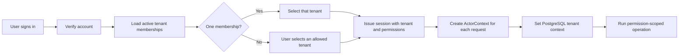

# Multi-Tenant Demo Decision

## Decision

The CMS demo will use a **shared PostgreSQL database and shared schema**. Each college is represented by a tenant record, and every college-owned record includes `tenant_id`.

The initial tenants are:

- `indus-arts-science`: INDUS ARTS & SCIENCE INTERNATIONAL COLLEGE
- `indus-law`: INDUS LAW COLLEGE

This design is simpler to operate than separate databases while still providing strong isolation through application authorization and PostgreSQL Row-Level Security.

## Data Ownership

Platform-owned records do not belong to one college:

- User accounts
- Permission definitions
- Platform subscription metadata

Tenant-owned records always include `tenant_id`:

- Campuses and college settings
- Memberships and role assignments
- Departments, programs, terms, sections, subjects, and timetables
- Students, guardians, faculty, and enrollments
- Attendance sessions and entries
- Fee plans, invoices, payments, and receipts
- Notices and dashboard source records
- Audit events

## Authentication and Tenant Resolution



The immutable request context contains:

```text
account_id
tenant_id
membership_id
permissions
```

The browser may request a switch to another tenant, but the backend accepts it only when the account has an active membership in that tenant. The backend then issues a refreshed session for the selected membership.

## Database Enforcement

Tenant isolation is implemented at two levels.

### Application level

- Protected endpoints require an authenticated actor.
- Actions require named permissions.
- Services use `actor.tenant_id`; they never trust a tenant ID supplied by a form or URL.
- Record-level rules restrict faculty to assigned classes and students to their own records.

### PostgreSQL level

- Tenant-owned tables have `tenant_id NOT NULL`.
- Row-Level Security policies compare `tenant_id` with transaction-local `app.tenant_id`.
- Row-Level Security is forced for the runtime database role.
- Unique constraints include tenant scope.
- Tenant-safe foreign keys prevent a record in one college from referencing a record in another.

Conceptual policy:

```sql
USING (tenant_id = current_setting('app.tenant_id', true)::uuid)
WITH CHECK (tenant_id = current_setting('app.tenant_id', true)::uuid)
```

The API transaction sets the context before querying tenant-owned data:

```sql
SELECT set_config('app.tenant_id', :tenant_id, true);
```

The `true` argument makes the value transaction-local so it does not leak into another request using the same pooled database connection.

## Users Across Both Colleges

An account is global, but access is tenant-specific through memberships.

```text
accounts
  1 -> many tenant_memberships
tenant_memberships
  many -> 1 tenant
  1 -> many membership_role_assignments
```

Example:

- The platform demo administrator can have one membership in each INDUS college.
- An Arts and Science faculty member has only an Arts and Science membership.
- A Law College student has only a Law College membership.

The same account can hold different roles in different colleges without sharing college data.

## Tenant Branding

Each tenant stores:

- Display name
- Short name
- Logo or initials
- Primary and accent colors
- Contact details
- Campus information
- Academic settings

The application loads branding from the active tenant. Theme selection may adjust the interface style, but it does not change or identify the tenant by itself. The active college name remains visible in the sidebar and page context.

## Demo Seeding

The seed command creates both tenants idempotently using stable tenant keys. All dependent demo records are linked to the correct tenant explicitly.

Seed order:

1. Permission definitions
2. Tenant records and branding
3. Accounts
4. Memberships, roles, and role assignments
5. Campuses and academic structures
6. Faculty and students
7. Timetables and attendance
8. Fee invoices, payments, and receipts
9. Notices

All people and contact details are synthetic. The demo password comes from an environment variable and is never committed.

## Minimum Isolation Check

Although broad unit-test coverage is deferred for the demo, tenant isolation is not deferred. The focused check must prove:

1. Tenant A can read one of its own students.
2. Tenant B cannot read that student by changing the identifier.
3. Tenant B cannot create a dependent record referencing Tenant A data.
4. An account cannot switch to a tenant without an active membership.
5. A student cannot read another student's private record within the same tenant.

This check runs against PostgreSQL because SQLite cannot verify PostgreSQL Row-Level Security behavior.

## Later Scaling Options

The shared-schema model is suitable for the demo and initial product. If a future institution requires physical database separation, the domain APIs can remain stable while introducing a dedicated database or schema for that tenant. That operational option is not needed now.
