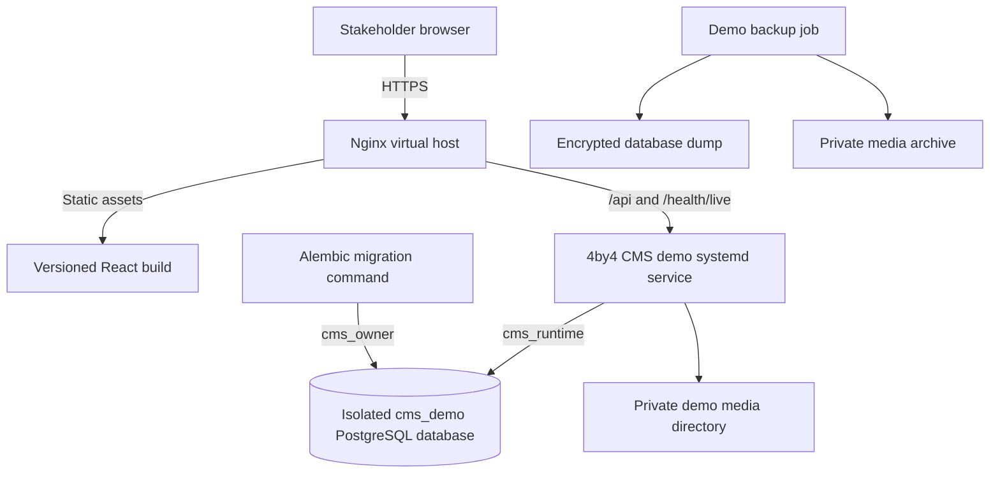

# AWS Demo Deployment Plan

## Status

Prepared on 18 September 2026. This is a deployment plan only. No AWS resource, DNS record, database, service, certificate, or application release has been created or changed from this repository review.

The target is a controlled stakeholder demo using synthetic data. It is not a production-ready release and must not contain real college, student, guardian, payment, identity, document, or provider data.

## Current Readiness

The repository contains a PostgreSQL-backed FastAPI application, a React/Vite portal, Alembic migrations through `e2b7c4d91a60`, forced tenant RLS, idempotent two-tenant demo onboarding, private local media storage, and 219 production API paths.

The existing deployment assets are not yet sufficient for the implemented application:

- `deployment/deploy.sh` builds and publishes only the static frontend.
- `deployment/nginx-https.conf` serves the SPA but does not proxy `/api/` or `/health/live` to FastAPI.
- No backend release artifact or virtual environment is installed by the script.
- No systemd unit exists for the CMS API.
- No remote migration, database-role bootstrap, demo onboarding, media-directory setup, backup, or backend rollback is performed.

Do not run the existing script as a full-stack release. It may be retained as a frontend artifact prototype until the guarded demo deployment workflow below is implemented and reviewed.

## Demo Architecture



### Recommended Topology

- Region: the approved AWS region already used by the organization.
- Compute: an existing shared EC2 host may be used only after capacity and service-isolation review; otherwise use one small dedicated demo instance.
- Public host: a dedicated demo hostname such as `ias-cms.4by4softwares.com`.
- Nginx: one isolated virtual host. Existing unrelated virtual hosts must not be edited or restarted.
- Frontend: immutable Vite assets under a versioned release directory with a `current` symlink.
- Backend: one loopback-only Uvicorn service, for example `127.0.0.1:8010`, managed by `4by4-cms-demo.service`.
- Database: one isolated `cms_demo` database on a private PostgreSQL service. Use separate owner/migration and restricted runtime credentials; PostgreSQL must not be publicly reachable.
- Media: one private persistent directory outside release folders, for example `/var/lib/4by4-cms-demo/media`, readable only by the CMS service account.
- Artifacts: a private, project-specific S3 prefix or bucket. Do not reuse another application's object paths without explicit approval.
- TLS: an approved certificate for the demo hostname. HTTP redirects to HTTPS.

## Environment Boundary

Store deployment values in a root-owned environment file such as `/etc/4by4-cms-demo.env` with mode `0600`. Required variables are:

```text
ENVIRONMENT=demo
DATABASE_URL=postgresql+psycopg://<migration-role>:<secret>@127.0.0.1:<port>/cms_demo
RUNTIME_DATABASE_URL=postgresql+psycopg://<runtime-role>:<secret>@127.0.0.1:<port>/cms_demo
SECRET_KEY=<random-demo-signing-secret-at-least-32-bytes>
CORS_ORIGINS=https://<demo-hostname>
MEDIA_STORAGE_PATH=/var/lib/4by4-cms-demo/media
```

`DEMO_SEED_PASSWORD` is supplied only to the explicit onboarding command. It should not remain in the long-running API environment after seed completion. Never print any secret value in SSM output, shell history, logs, documentation, or build artifacts.

## Required Deployment Assets

Prepare and review these files before the first AWS action:

1. `deployment/4by4-cms-demo.service`
   - Runs the installed virtual environment's Uvicorn executable.
   - Uses `app.production_main:app`.
   - Binds only to loopback.
   - Loads `/etc/4by4-cms-demo.env`.
   - Runs as a dedicated unprivileged service account.
   - Uses restart limits and a writable media path only.

2. `deployment/nginx-https.conf`
   - Keeps the dedicated hostname and TLS configuration.
   - Serves hashed assets with immutable caching.
   - Serves `index.html` with no long-lived cache.
   - Proxies `/api/` and `/health/live` to the loopback API.
   - Sets proxy forwarding headers and conservative request-body limits.
   - Does not expose the media directory directly.

3. `deployment/deploy-demo.sh`
   - Fails unless `DEMO_DEPLOY_CONFIRM=1` is explicitly provided.
   - Runs local preflight before any S3, SSM, database, or service action.
   - Builds a versioned frontend and backend artifact.
   - Uploads to a project-specific private artifact location.
   - Activates a versioned release through an atomic `current` symlink.
   - Runs Alembic with the migration role before restarting the API.
   - Runs demo onboarding only when `--seed-demo` is explicitly supplied.
   - Restarts only `4by4-cms-demo.service` and reloads only validated Nginx configuration.
   - Performs health and non-destructive public checks.

4. `deployment/rollback-demo.sh`
   - Restores the previous release symlink and Nginx configuration.
   - Restarts only the CMS demo service.
   - Does not automatically downgrade the database.
   - Requires a reviewed forward-fix or restore plan when a migration is not backward compatible.

5. `deployment/backup-demo.sh`
   - Creates an encrypted `pg_dump` of `cms_demo`.
   - Archives private media separately.
   - Uploads backups to a private project-specific location with retention.
   - Records the release ID and migration revision without storing credentials.

## Nginx Routing Requirements

The final virtual host must implement these behaviors:

```nginx
location /api/ {
    proxy_pass http://127.0.0.1:8010;
    proxy_set_header Host $host;
    proxy_set_header X-Forwarded-For $proxy_add_x_forwarded_for;
    proxy_set_header X-Forwarded-Proto $scheme;
    client_max_body_size 6m;
}

location = /health/live {
    proxy_pass http://127.0.0.1:8010/health/live;
}

location /assets/ {
    try_files $uri =404;
    expires 30d;
    add_header Cache-Control "public, immutable";
}

location / {
    try_files $uri $uri/ /index.html;
    add_header Cache-Control "no-cache";
}
```

The exact certificate paths, hostname, port, and web root remain environment-specific and must be reviewed on the target host before installation.

## Deployment Sequence

### Phase 0: Approval and Inventory

1. Confirm the demo hostname and whether the target EC2 host is shared or dedicated.
2. Confirm CPU, memory, disk, PostgreSQL capacity, and free loopback port.
3. Confirm the project-specific private artifact and backup locations.
4. Confirm DNS and certificate ownership.
5. Record existing Nginx sites and systemd services; identify names that must not be touched.
6. Approve synthetic demo identities, temporary password handling, and demo retention period.

### Phase 1: Local Release Gate

1. Start local PostgreSQL and apply all migrations.
2. Confirm Alembic head and zero metadata drift.
3. Run focused backend Ruff checks.
4. Run the frontend production build.
5. Run the complete approved local backend and browser suites available at deployment time.
6. Exercise both tenant logins and cross-tenant denial against local PostgreSQL.
7. Exercise desktop and 390 px role dashboards, workspace screens, private downloads, and printable documents.
8. Record known limitations and obtain explicit demo deployment approval.

Formal automated coverage is currently deferred. Until Slice 8 is complete, this environment must remain labelled demo and must not be promoted to production.

### Phase 2: Host Bootstrap

Perform once, through reviewed SSM commands or configuration management:

1. Create a dedicated Linux service account and release/media/log directories.
2. Install the supported Python runtime, virtual environment, and required OS libraries.
3. Create the isolated PostgreSQL database and restricted roles without exposing passwords.
4. Install the root-owned environment file.
5. Install but do not start the systemd service.
6. Install the Nginx virtual host and certificate only after `nginx -t` succeeds.
7. Configure private artifact read access and private backup write access.
8. Verify firewall/security-group rules expose only approved HTTP/HTTPS and management paths.

### Phase 3: First Release

1. Generate a UTC release ID.
2. Build frontend assets and a backend wheel or locked source artifact.
3. Upload immutable artifacts and a checksum manifest.
4. Download into a new host release directory.
5. Create the release virtual environment and install the backend artifact.
6. Back up the current database and media directory.
7. Run `alembic upgrade head` using `DATABASE_URL` and the migration role.
8. Run `app.commands.onboard_tenants --seed-demo` once with the approved temporary password.
9. Remove `DEMO_SEED_PASSWORD` from the long-running environment.
10. Atomically update the backend and frontend `current` symlinks.
11. Start or restart only `4by4-cms-demo.service`.
12. Validate Nginx configuration and reload Nginx.

### Phase 4: Demo Verification

1. Verify `/health/live` through loopback and public HTTPS.
2. Verify SPA deep-link refresh for `/login`, `/portal/dashboard`, and one module route.
3. Authenticate one Arts & Science and one Law College demo account.
4. Confirm tenant branding and source-backed dashboards.
5. Confirm a direct cross-tenant identifier request is denied.
6. Confirm one private document can be downloaded only by its authorized actor.
7. Confirm one receipt or examination document renders and prints.
8. Confirm media persists after an API service restart.
9. Inspect service and Nginx logs for secrets, tracebacks, and unrelated-service impact.
10. Record the release ID, Alembic revision, verification time, known limitations, and rollback target.

Do not run destructive Playwright journeys against the public demo. Use non-mutating smoke checks after deployment.

## Rollback

- Frontend/backend code rollback: move the `current` symlink to the previous release and restart only the CMS demo service.
- Nginx rollback: restore the previous isolated virtual-host file, run `nginx -t`, then reload.
- Database rollback: prefer a forward fix. Restore the pre-release database dump only when explicitly approved and after stopping the CMS service.
- Media rollback: restore only from the matching backup when database metadata and media objects must move together.
- Failed first deployment: disable only the CMS demo virtual host and service; leave unrelated shared-host applications untouched.

## Demo Security Boundary

- Synthetic data only.
- Visible demo credentials are temporary and intentionally demonstrative.
- No production identity, Aadhaar, payment-card, real guardian, private college, or student data.
- No production email/SMS/payment provider credentials.
- No public PostgreSQL or media-directory access.
- Restricted runtime role cannot bypass forced RLS.
- Owner credentials are used only by migrations/onboarding.
- HTTPS only, except ACME challenge and redirect.
- Logs exclude tokens, passwords, document contents, database URLs, and signed data.
- Database and media backups are private and retention-limited.

## Cost Boundary

For a shared-host demo, incremental cost should be limited to storage, transfer, DNS, certificate operations, and backup artifacts, subject to current account pricing and existing capacity. A dedicated instance or managed database changes that estimate and requires a separate cost review. Do not publish a fixed monthly estimate until the target instance, storage volume, traffic, backup retention, and database choice are confirmed.

## Explicit Non-Production Limitations

- Formal automated release suites are not complete.
- Media uses local private filesystem storage rather than production object storage and malware scanning.
- Email/SMS providers, payment callbacks, and scheduled-report workers are not implemented yet.
- The public institution site is source-coded and only the Arts & Science tenant has public content.
- Attendance policy is not institution-versioned.
- Worker monitoring, production backup restoration evidence, autoscaling, high availability, and disaster recovery are not complete.
- The shared synthetic password and visible sample accounts are unsuitable for production.

## Deployment Approval Gate

No AWS action may begin until all of the following are explicit:

- target account, region, host, and hostname;
- shared-host impact review;
- artifact and backup locations;
- database and media persistence plan;
- environment secret installation method;
- local release-gate evidence;
- rollback owner and previous release;
- confirmation that only synthetic demo data will be used;
- direct user approval to deploy.
